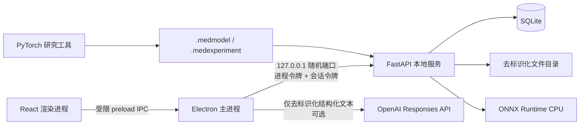

# 系统架构

## 定位

本项目由可复现胸片研究工具和本地 Windows 阅片软件组成。v0.1 只接受成人正位 AP/PA 胸片，用于科研与竞赛原型，不是医疗器械，也不能独立作出诊断。

## 组件与信任边界

- 渲染进程启用 `contextIsolation`、sandbox，并关闭 Node 集成。
- preload 只暴露固定文件选择命令和经白名单校验的服务请求；渲染进程拿不到本地路径、进程令牌、SQLite 或密钥文件。
- 文件对话框和实际路径只存在于 Electron 主进程。模型安装、实验包导入和 PDF 导出使用主进程固定命令。
- FastAPI 只绑定 `127.0.0.1` 的随机端口。每次启动生成新的进程令牌；用户会话令牌保存在主进程内存中，退出时撤销。
- 本地核心流程不依赖网络。在线助手没有工具调用权限，也不能写数据库、安装模型或确认报告。

## 目录职责

| 目录 | 职责 |
| --- | --- |
| `ml/cxr_research` | CheXpert 划分、训练、指标、MIMIC 封存评价、ONNX 和研究包 |
| `services/inference` | 准入、匿名化、模型注册、推理、权限、报告和助手适配器 |
| `apps/desktop` | Electron 主进程、preload、React 工作区和 Cornerstone3D 查看器 |
| `contracts` | 固定标签、共享 TypeScript 类型和 JSON Schema |
| `tests/python` | 合成 DICOM、真实 ONNX Runtime 路径和安全回归测试 |
| `third_party` | 参考项目和实际依赖许可声明 |

## 启动序列

1. Electron 创建用户数据目录并启动打包后的服务；开发模式从项目 `.venv` 启动 Python 3.11。
2. 服务选择空闲端口，向父进程标准输出发送一次包含主机、端口和随机令牌的 JSON 握手。
3. Electron 校验主机必须为 `127.0.0.1`，之后为每个请求附加进程令牌。
4. 首次启动创建管理员；后续登录把独立会话令牌留在主进程，渲染进程只获得角色和随机用户 ID。
5. 模型注册表读取 `active-model.json`，重新验证 `.medmodel` 全部哈希后才恢复 ONNX 会话。

## 关键数据流

### 影像导入

`选择文件 -> 临时区 -> 解码与准入 -> 人工确认/遮挡 -> 派生去标识化副本 -> SQLite 随机检查编号`

失败、取消或提交都会删除临时原件；服务重新启动时也清理异常退出遗留的临时文件。原文件不会成为应用数据库的一部分。

### 推理与复核

`去标识化影像 -> 固定预处理 -> ONNX logits + 特征图 -> 14 项概率 -> 独立医生复核`

预测记录不可覆盖。医生的“确认、否认、不确定”和备注保存在独立 `Review` 中，不修改原始概率。

### 报告

草稿每次保存都创建新版本。只有作者医生可以确认；确认后版本锁定。PDF 包含报告正文和 AI 附录，附录记录模型版本、模型/清单哈希、阈值、概率与复核记录。

## 扩展边界

后续 CT、分割或其他医学影像能力应新增独立研究模块、模型清单版本和 UI 工作区，不应放宽 v0.1 的成人 AP/PA 胸片准入规则。任何新模型必须拥有明确标签语义、输入契约、许可和独立验证门禁。
